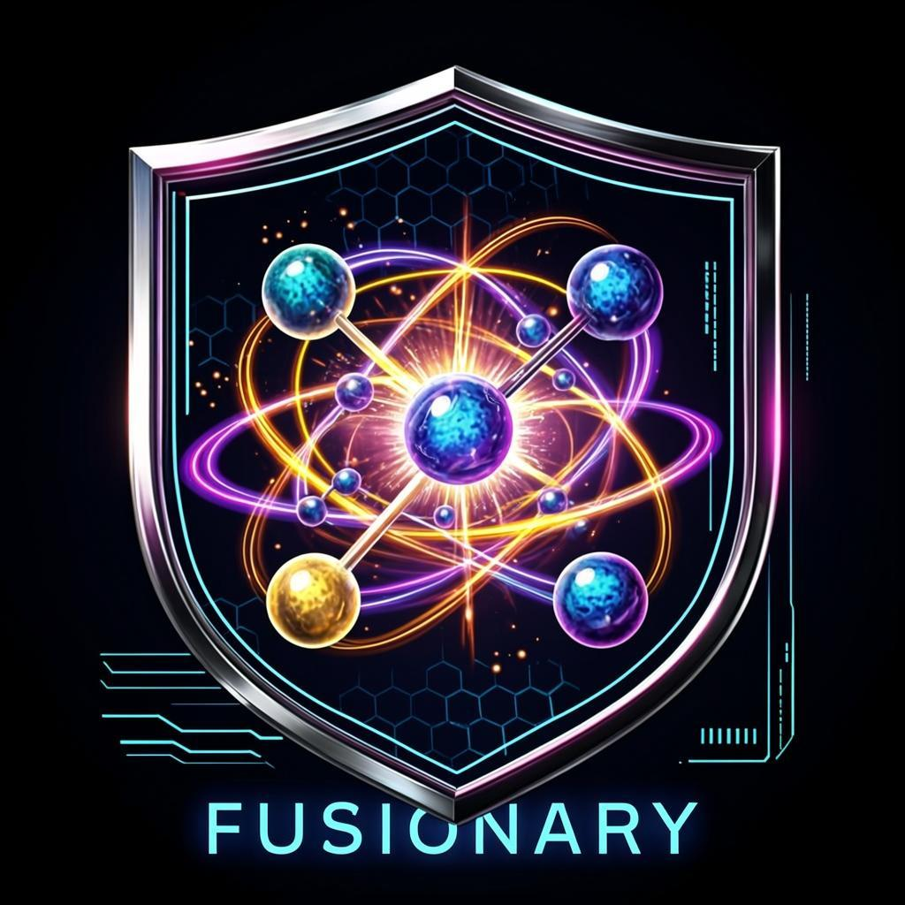

# FUSIONARY v1.0

<p align="center">
  
</p>

<p align="center">
  <em>Autonomous Scientific Research Agent for Practical, Safe, Short-to-Mid-Term Nuclear Fusion Energy</em>
</p>

### **F**usion-**U**tilising **S**cientific **I**nvestigator for **O**rganised **N**ovel **A**dvances in **R**esearch, **Y**ielding patentable solutions

> An Autonomous Scientific Research Agent for **Practical, Safe, Short-to-Mid-Term Nuclear Fusion Energy**.
>
> Built on the Artificial Junky Neuron (AJN) framework by Justo Tapiador Garcia (Universidad de Alicante),
> drastically extended from [`predator-jungle-agent`](https://github.com/Justo-Tapiador/predator-jungle-agent) v2.0.
>
> **npm package:** `fusionary-agent` · **CLI command:** `fusionary` · **License:** MIT

[](https://nodejs.org/)
[](https://opensource.org/licenses/MIT)
[](#)
[](#theoretical-basis)

---

## Table of Contents

1. [Mission Statement](#1-mission-statement)
2. [What's New vs predator-jungle-agent v2.0](#2-whats-new-vs-predator-jungle-agent-v20)
3. [Architecture](#3-architecture)
4. [Installation](#4-installation)
5. [Quick Start](#5-quick-start)
6. [Configuration](#6-configuration)
7. [Multi-LLM Adapters](#7-multi-llm-adapters)
8. [The Research Loop](#8-the-research-loop)
9. [Document Archive Layout](#9-document-archive-layout)
10. [The Patent Pipeline](#10-the-patent-pipeline)
11. [Web Dashboard](#11-web-dashboard)
12. [CLI Reference](#12-cli-reference)
13. [Programmatic API](#13-programmatic-api)
14. [The AJN Six-Phase Lifecycle](#14-the-ajn-six-phase-lifecycle)
15. [Theoretical Basis](#15-theoretical-basis)
16. [Project Structure](#16-project-structure)
17. [Research Roadmap](#17-research-roadmap)
18. [Safety & Guardrails](#18-safety--guardrails)
19. [Plugin System](#19-plugin-system)
20. [Docker Deployment](#20-docker-deployment)
21. [FAQ](#21-faq)
22. [Citing FUSIONARY](#22-citing-fusionary)
23. [License](#23-license)

---

## 1. Mission Statement

> **Achieve a practically inexhaustible, safe energy source in the short-to-medium term using nuclear fusion.**

FUSIONARY is not a chatbot and not a generic LLM wrapper. It is an **autonomous scientific research agent** that, on launch, immediately begins working on the fusion-energy problem — generating hypotheses, drafting design proposals, evaluating resource feasibility, and preparing patent applications. It does **not** wait for an owner directive (this is the AJN "addiction" property inherited from `predator-jungle-agent`). The human owner may, at any moment, guide it toward a specific intermediate goal via the web UI or CLI, but the agent never idles.

Every proposed solution must satisfy two hard constraints:

1. **Resource anchoring** — It must be linked to technologies, materials, or facilities that human civilisation **possesses today** or **will possess** if the proposed apparatuses and infrastructures are built. Pure speculation (cold fusion, muon-catalysed at industrial scale, p-B11 in a tokamak) is rejected by the safety guardrails.
2. **Patent coherency** — Successful intermediate or final solutions are grouped, tagged, and drafted as patent applications. Documents cross-reference each other through a CitationGraph so that nothing remains isolated.

The topic universe includes (but is not limited to):

- Magnetic confinement: tokamak, stellarator, spherical tokamak
- Inertial confinement: laser-driven (NIF-class), ion-driven, z-pinch
- Magneto-inertial fusion (MIF / MagLIF-class)
- Aneutronic fuels: p-B11, D-³He
- Tritium breeding & fuel cycle (HCPB, DCLL, WCLL, HCLL blankets)
- Plasma-facing components (liquid lithium, tungsten, beryllium)
- High-temperature superconducting magnets (REBCO, Bi-2212)
- Diagnostics & control (real-time MHD feedback)
- Energy extraction & balance-of-plant
- Reactor economics & LCOE modelling

---

## 2. What's New vs predator-jungle-agent v2.0

FUSIONARY inherits the entire AJN/ANN-Psi backbone, real Transformer blocks, persistent memory, safety guardrails, plugin architecture, and LLM integration from `predator-jungle-agent` v2.0. The following are the **drastic enhancements** that make it a domain-specialised scientific researcher:

| Enhancement | Description |
|-------------|-------------|
| **Domain-specialised backbone** | 14-layer ANN-Psi (was 12) with stimulus classes for every fusion sub-domain (tokamak, stellarator, ICF, MIF, p-B11, tritium breeding, REBCO magnets, …) |
| **Multi-objective reward** | Each AJN now optimises `quality × novelty × feasibility × patentability` instead of a scalar signal |
| **Stratified experience replay** | Top-quartile experiences are replayed more often, accelerating convergence toward patent-eligible solutions |
| **FusionKnowledgeGraph** | 18 baseline concepts and 16 relation types seeded from current state-of-the-art (ITER, SPARC, NIF, MagLIF, REBCO, liquid lithium, …) with Mermaid graph export |
| **HypothesisGenerator** | LLM- or template-based generator that finds under-explored KG regions and produces structured hypotheses with predicted impact, feasibility tier, and candidate patent claims |
| **ResourceFeasibilityChecker** | Hard-gates every proposal against 16+ real-world resource anchors (ITER, SPARC, NIF, REBCO tape production, lithium supply, tritium inventory, etc.) with five-tier verdict |
| **PatentDraftAssistant** | USPTO/EPO-style drafter producing title, abstract, field, background, summary, drawings, detailed description, and independent + dependent claims |
| **DocumentArchivist** | Hierarchical archive under `/research/{topics,hypotheses,designs,simulations,patents,cross_refs,indices}/` with per-document `manifest.json` and auto-rebuilt `INDEX.md` + `patent_queue.md` |
| **CitationGraph** | Cross-references every document with external papers (arXiv, DOI) and prior-art blocking searches |
| **PlasmaPhysicsTool** | Bosch-Hale `<σv>` for D-T, D-D, p-B11; bremsstrahlung; net power balance; TBR calculator |
| **LaTeXDocumentTool** | Compiles patent drafts to PDF via `pdflatex` when available; otherwise writes the `.tex` source for manual compilation |
| **Multi-LLM router** | `LLMRouter` with auto-failover across ZAI (GLM-4.6), Anthropic Claude, OpenAI GPT, and local Ollama — pick the most powerful available model per call |
| **Web dashboard** | Six-tab dashboard: real-time feed, archive browser, patent queue, KG Mermaid view, live metrics, owner guidance panel |
| **Plugin hooks** | New hooks: `hypothesisGenerated`, `patentDrafted`, `documentArchived`, `feasibilityChecked`, `ownerDirective` |

---

## 3. Architecture

```
              ┌──────────────────────────────────────────────────┐
              │              OWNER (human, optional)              │
              │  Web UI / CLI — guides toward intermediate goals  │
              └───────────────────────┬──────────────────────────┘
                                      │ owner directive
                                      ▼
              ┌──────────────────────────────────────────────────┐
              │   Hierarchical Command Interpreter (HCI)          │
              │   LLM-enhanced parsing + task decomposition       │
              └───────────────────────┬──────────────────────────┘
                                      │ addiction target injection
                                      ▼
   ┌──────────────────────────────────────────────────────────────────────┐
   │                  ANN-Psi Backbone  (14 layers)                        │
   │                                                                       │
   │   L1-L2   Hybrid AJN       sensory encoding of fusion literature      │
   │   L3       Hetero AJN K=8   concept features                          │
   │   L4-L5   Transformer       cross-document context attention          │
   │   L6       Hetero AJN K=16  reactor-class concepts                    │
   │   L7       Hybrid AJN       resource-feasibility modulation           │
   │   L8-L9   Transformer       reasoning over hypothesis chains          │
   │   L10      Hetero AJN K=32  patent-eligible concept clusters          │
   │   L11      Hybrid AJN       design synthesis                          │
   │   L12      Hetero AJN K=8   patent-claim assembly                     │
   │   L13      Hybrid AJN       document structuring (TeX section plan)   │
   │   L14      Output AJN       TPS emission (research action stream)     │
   └────────────────────────────────────────┬─────────────────────────────┘
                                            │ praxis stream
                                            ▼
              ┌──────────────────────────────────────────────────┐
              │   Safety Guardrails (3 levels)                    │
              │   - forbidden-physics filter (cold fusion, LENR)  │
              │   - tritium inventory cap (50 kg)                  │
              │   - resource-anchor requirement (strict mode)      │
              └───────────────────────┬──────────────────────────┘
                                      ▼
              ┌──────────────────────────────────────────────────┐
              │   Token-Energy Arbitrator (PID-controlled)        │
              └───────────────────────┬──────────────────────────┘
                                      ▼
              ┌──────────────────────────────────────────────────┐
              │   Praxic Stream Executor (PSE)                    │
              │   Retry, timeout, parallel execution, audit log   │
              └───────────────────────┬──────────────────────────┘
                                      ▼
              ┌──────────────────────────────────────────────────┐
              │   Specialised tools                               │
              │   - LaTeXDocumentTool (TeX → PDF)                 │
              │   - PlasmaPhysicsTool (Lawson, <σv>, TBR)         │
              │   - WebSearchTool (literature lookup)             │
              │   - BibliographyTool (BibTeX builder)             │
              │   - FileSystemTool (sandboxed I/O)                │
              └───────────────────────┬──────────────────────────┘
                                      │ artifacts
                                      ▼
              ┌──────────────────────────────────────────────────┐
              │   Domain modules                                  │
              │   - HypothesisGenerator                           │
              │   - ResourceFeasibilityChecker                    │
              │   - PatentDraftAssistant                          │
              │   - DocumentArchivist  →  /research/<category>/   │
              │   - FusionKnowledgeGraph                          │
              │   - CitationGraph                                 │
              └───────────────────────┬──────────────────────────┘
                                      │ feedback
              ┌────────────────────────┴───────────────────────────┐
              │   MemorySystem (3-tier)  +  MetricsCollector        │
              │   + CascadeMonitor  +  PluginManager                │
              └────────────────────────────────────────────────────┘
```

---

## 4. Installation

### Requirements

- **Node.js ≥ 18.0.0**
- *(Optional)* `pdflatex` for PDF compilation — otherwise `.tex` files are still produced
- *(Optional)* `git` for version-controlled research archives
- *(Optional)* An API key for at least one LLM provider (ZAI, OpenAI, or Anthropic)

### From npm (recommended once published)

```bash
# Install as a project dependency
npm install fusionary-agent

# Or install globally to use the CLI everywhere
npm install -g fusionary-agent
fusionary research            # autonomous mode
fusionary web                 # dashboard at http://localhost:3000
```

### From source

```bash
git clone https://github.com/Justo-Tapiador/fusionary-agent.git
cd fusionary-agent
npm install
cp .env.example .env       # then edit .env with your API keys
npm run research           # autonomous mode
```

### Docker

```bash
docker build -t fusionary-agent -f docker/Dockerfile .
docker run -p 3000:3000 \
  -v $(pwd)/research:/app/research \
  -v $(pwd)/data:/app/data \
  --env-file .env \
  fusionary-agent
```

---

## 5. Quick Start

### Autonomous research (default)

```bash
npm run research
```

FUSIONARY boots, initialises its KG, memory, citation graph, and archive, then immediately starts the first research cycle. You will see output like:

```
[Cycle 1] starting...
  ✓ Hypothesis generated:
    Increasing the on-axis magnetic field from 5 T to 20 T via REBCO HTS coils yields
    a 64-fold increase in fusion power density, reducing the reactor radius needed for
    net energy by a factor of 4.
    Feasibility: near_term
  ✓ Patent draft:
    Fusion Reactor System and Method Based on tokamak Confinement with REBCO HTS Magnets
    4 claims
  → Archived: patents/general/patent_a1b2c3d4/
```

### Web dashboard

```bash
npm run web
# Open http://localhost:3000
```

### Send an owner directive

```bash
npm run guide "Focus on tritium breeding TBR > 1.2 with HCPB blanket and REBCO magnets at 12 T"
```

### Demo (3 cycles)

```bash
npm run demo
```

---

## 6. Configuration

Configuration is layered:

1. `config/default.json` — defaults
2. `config/production.json` — production overrides
3. `.env` — environment variable overrides

### Key environment variables

| Variable | Default | Description |
|----------|---------|-------------|
| `FUSIONARY_RESEARCH_DIR` | `./research` | Root directory for the document archive |
| `FUSIONARY_MAX_CYCLES` | `50` (CLI) / `500` (web) | Maximum research cycles per run |
| `FUSIONARY_SAFETY` | `standard` | Safety level: `permissive` / `standard` / `strict` |
| `FUSIONARY_PORT` | `3000` | Web dashboard port |
| `FUSIONARY_HOST` | `0.0.0.0` | Web dashboard host |
| `ZAI_API_KEY` | — | Z.ai API key (often pre-provisioned in the SDK) |
| `ANTHROPIC_API_KEY` | — | Anthropic API key for Claude failover |
| `OPENAI_API_KEY` | — | OpenAI API key for GPT failover |
| `OLLAMA_ENDPOINT` | `http://localhost:11434` | Local LLM endpoint |

### `.env.example`

```bash
# FUSIONARY configuration
FUSIONARY_RESEARCH_DIR=./research
FUSIONARY_MAX_CYCLES=500
FUSIONARY_SAFETY=standard
FUSIONARY_PORT=3000

# LLM API keys (any one is sufficient; router falls over automatically)
ZAI_API_KEY=
ANTHROPIC_API_KEY=
OPENAI_API_KEY=

# Optional local LLM (Ollama)
OLLAMA_ENDPOINT=http://localhost:11434
OLLAMA_MODEL=llama3.1:70b
```

---

## 7. Multi-LLM Adapters

FUSIONARY ships with four adapters and a router that tries them in priority order:

| Adapter | Default model | When to use |
|---------|---------------|-------------|
| `ZAIAdapter` | `glm-4.6` | **Recommended.** 200K context, strong STEM reasoning, tool-use. |
| `AnthropicAdapter` | `claude-opus-4-1` | Failover for legal/patent text refinement. |
| `OpenAIAdapter` | `gpt-4o` | Tertiary failover. |
| `LocalLLMAdapter` | `llama3.1:70b` | Air-gapped deployments; fine-tuned models. |

### Setting up the router

```javascript
import { LLMRouter, ZAIAdapter, AnthropicAdapter, OpenAIAdapter } from 'fusionary-agent';

const router = new LLMRouter();
router.register(new ZAIAdapter({ model: 'glm-4.6' }),        priority: 100);
router.register(new AnthropicAdapter({ model: 'claude-opus-4-1' }), priority: 200);
router.register(new OpenAIAdapter({ model: 'gpt-4o' }),      priority: 300);

const agent = await createFusionary({ llm: router });
```

If GLM-4.6 is unreachable, the router transparently fails over to Claude, then GPT-4o, then the local model. Adapter health is tracked automatically — failing adapters are demoted for 30 seconds before being retried.

---

## 8. The Research Loop

Each cycle runs the following pipeline:

1. **Directive interpretation** — `HierarchicalCommandInterpreter` parses the owner directive (if any) into a structured `ResearchPlan`. If no directive is set, the agent picks the most under-explored topic from the `FusionKnowledgeGraph`.

2. **ANN-Psi forward pass** — The 14-layer backbone emits a praxis vector encoding the research action.

3. **Hypothesis generation** — `HypothesisGenerator` synthesises a structured hypothesis (statement, rationale, supporting concepts, predicted impact, proposed experiments, candidate patent claims). It uses the LLM when available, otherwise falls back to deterministic templates.

4. **Feasibility assessment** — `ResourceFeasibilityChecker` returns a tier (`current` / `near_term` / `mid_term` / `long_term` / `speculative`), confidence, anchors, gaps, cost estimate, timeline, and safety profile. Proposals with no anchor or speculative-only physics are rejected.

5. **Patent drafting** — If the feasibility tier is not `speculative`, `PatentDraftAssistant` drafts a USPTO/EPO-style application with independent and dependent claims.

6. **Archiving** — Both the hypothesis and the patent draft are stored under `/research/<category>/<topic>/<id>/` with a `manifest.json` recording all metadata. LaTeX source is always written; PDF compilation is attempted if `pdflatex` is on PATH.

7. **Memory + metrics update** — The cycle is stored in episodic memory; KPI histograms (quality, novelty, feasibility, patentability) are updated.

8. **Plugin hooks** — `afterStep`, `hypothesisGenerated`, `patentDrafted`, `documentArchived`, `feasibilityChecked` hooks fire.

9. **Index rebuild** — Every 5 cycles, the master `INDEX.md` and `indices/patent_queue.md` are rebuilt.

---

## 9. Document Archive Layout

```
research/
├── INDEX.md                      ← master index (auto-generated)
├── topics/                       ← background research notes
│   └── concept_tokamak/
│       └── doc_abc12345/
│           ├── manifest.json
│           ├── main.tex
│           ├── main.pdf
│           └── references.bib
├── hypotheses/                   ← formalised hypothesis records
├── designs/                      ← reactor / sub-system design proposals
├── simulations/                  ← numerical simulation reports
├── patents/                      ← patent application drafts
├── cross_refs/                   ← cross-reference indices
└── indices/
    └── patent_queue.md           ← patent-eligible documents queue
```

### `manifest.json` schema

```json
{
  "id": "doc_abc12345",
  "version": "1.0",
  "title": "High-field tokamak with REBCO magnets at 20 T",
  "category": "designs",
  "topic": "concept_tokamak",
  "tags": ["magnetic_confinement", "HTS_magnet", "patent_ready"],
  "references": ["concept_reco_magnet", "concept_lawson"],
  "patent": {
    "eligible": true,
    "claims": ["A fusion reactor system comprising...", "The system of claim 1..."]
  },
  "createdAt": 1735689600000,
  "updatedAt": 1735689600000,
  "extra": {},
  "files": {
    "latex": "main.tex",
    "pdf": "main.pdf",
    "bibliography": "references.bib"
  }
}
```

---

## 10. The Patent Pipeline

```
Hypothesis generated
        │
        ▼
ResourceFeasibilityChecker
        │
        ├── tier = speculative  ──►  archive under hypotheses/, tag patent_pending
        │
        └── tier ∈ {current, near_term, mid_term, long_term}
                │
                ▼
        PatentDraftAssistant.draft()
                │
                ▼
        LaTeXDocumentTool compiles main.tex → main.pdf
                │
                ▼
        DocumentArchivist.archive({
          category: 'patents',
          tags: tier ∈ {current, near_term} ? ['patent_ready', 'final_result']
                                            : ['patent_pending', 'intermediate_result'],
          patent: { eligible: true, claims: [...] }
        })
                │
                ▼
        CitationGraph records prior-art links
                │
                ▼
        indices/patent_queue.md updated
```

### Tag semantics

| Tag | Meaning |
|-----|---------|
| `patent_ready` | Feasibility `current` or `near_term` — file immediately |
| `patent_pending` | Feasibility `mid_term` or `long_term` — monitor for breakthroughs |
| `intermediate_result` | Not yet a complete solution; supports a larger claim |
| `final_result` | Self-contained, patentable as-is |
| `baseline_knowledge` | Background literature (not patentable) |
| `human_directed` | Triggered by an owner directive |

---

## 11. Web Dashboard

The dashboard at `http://localhost:3000` provides six tabs:

| Tab | Purpose |
|-----|---------|
| **Research Feed** | Real-time WebSocket stream of every cycle, hypothesis, patent, and safety event |
| **Archive** | Searchable list of every archived document with tags |
| **Patent Queue** | All patent-eligible documents with their full claim text |
| **Knowledge Graph** | Mermaid source for the current KG (paste into mermaid.live) |
| **Metrics** | Live counters, gauges, and histograms (quality, novelty, feasibility, patentability) |
| **Owner Guidance** | Form to send a directive and quick-action buttons for common research targets |

### Quick directives shipped with the UI

- REBCO 20 T tokamak
- DCLL vs HCPB blanket comparison
- MagLIF at 27 MA peak current
- Liquid lithium first wall at 2 MW/m²
- p-B11 aneutronic with direct conversion

---

## 12. CLI Reference

```bash
fusionary research [--cycles N] [--safety strict|standard|permissive] [--no-autonomous]
fusionary guide "<directive>"
fusionary web
fusionary demo
fusionary train
fusionary checkpoint save|list|load [--label LABEL]
fusionary patents
fusionary archive
fusionary status
```

| Command | Description |
|---------|-------------|
| `research` | Run autonomous research (default mode) |
| `guide` | Send an owner directive to the running agent |
| `web` | Start the web dashboard |
| `demo` | Run a 3-cycle demo with verbose output |
| `train` | Run the 4-phase training pipeline |
| `checkpoint save` | Save a full agent state checkpoint |
| `checkpoint list` | List saved checkpoints |
| `checkpoint load` | Restore agent state from a checkpoint |
| `patents` | List patent-eligible documents |
| `archive` | Rebuild archive indices |
| `status` | Print a JSON status snapshot |

---

## 13. Programmatic API

```javascript
import { createFusionary } from 'fusionary-agent';

const agent = await createFusionary({
  researchDir: './research',
  safetyLevel: 'standard',
  maxCycles: 100,
  llm: new ZAIAdapter({ model: 'glm-4.6' }),
});

// Listen to events
agent.on('hypothesis:generated', (h) => {
  console.log('New hypothesis:', h.statement);
});
agent.on('patent:drafted', (p) => {
  console.log('New patent:', p.title);
});

// Guide the agent at any time
await agent.guide('Investigate REBCO tokamak at 20 T with Q > 10');

// Shutdown gracefully
await agent.shutdown();
```

### Custom tool registration

```javascript
import { Tool } from 'fusionary-agent';

class MyCustomTool extends Tool {
  constructor() {
    super();
    this.id = 'my_tool';
    this.name = 'My Custom Tool';
  }
  async execute(args) {
    return { ok: true, result: '...' };
  }
}

agent.tools.register(new MyCustomTool());
```

### Custom plugin

```javascript
agent.plugins.register({
  name: 'patent-logger',
  version: '1.0.0',
  hooks: {
    patentDrafted: (ctx) => {
      console.log(`Patent drafted: ${ctx.patentDraft.title}`);
    },
    documentArchived: (ctx) => {
      // Sync to external IP management system
    },
  },
});
```

---

## 14. The AJN Six-Phase Lifecycle

Each Artificial Junky Neuron autonomously cycles through six phases:

| Phase | Name | Behaviour in FUSIONARY |
|-------|------|------------------------|
| 1 | **Random** | High-entropy exploration of the fusion knowledge space |
| 2 | **Reinforce** | Bias developing toward a high-reward fusion stimulus |
| 3 | **Saturation** | Topic sufficiently explored; praxes suppressed |
| 4 | **Withdrawal** | Craving returns; threshold decays |
| 5 | **Frustration** | Failure state; covariance expands chaotically to break stuck states |
| 6 | **Extinction** | Addiction dissolved; reset to random exploration |

**Why this matters for fusion research**: traditional RL agents converge prematurely on a local optimum and never escape. The AJN's frustration phase forces chaotic exploration when reward plateaus — exactly the property needed to escape " ITER-only" thinking and explore alternative concepts like MagLIF, p-B11, or hybrid approaches.

---

## 15. Theoretical Basis

FUSIONARY's efficiency advantages derive directly from AJN saturation dynamics:

- **Token suppression in saturation** — During Phase 3, `‖P_t‖_F → 0`, so near-zero tokens are emitted when a topic is well-explored. This prevents the agent from re-tilling already-fertile ground.
- **Chaotic intensification in frustration** — During Phase 5, covariance expands, generating high-diversity praxes that break stuck states (e.g. moving from a D-T-only stance to considering p-B11).
- **Cascade prevention** — Lateral inhibition coupling reduces group extinction probability below the independent bound, preventing mass loss of learned concepts.
- **Adaptive compute** — The TEA combines PID-controlled energy-aware suppression with craving-driven override.
- **Self-healing** — The Cascade Monitor learns successful stimulus patterns and injects them proactively when risk trends upward.
- **Multi-objective reward** — FUSIONARY extends AJN with `quality × novelty × feasibility × patentability`, ensuring that the agent optimises for *useful* novelty rather than novelty for its own sake.

**Primary references**:

- Tapiador Garcia, J. (2024). *Agentic Theory: Definition of the Artificial Junky Neuron (AJN).* WALLERMAX-AI 2604.00012.
- Tapiador Garcia, J. (2024). *Agentic Theory II: The AJN and ANN-Psi.* WALLERMAX-AI 2604.00013.
- Tapiador Garcia, J. (2024). *Agentic Theory III: Stimulus Tensor Propagation.* WALLERMAX-AI 2604.00014.

**Fusion physics references**:

- Bosch, H.-S. & Hale, G. M. (1992). *Improved formulas for fusion cross-sections and thermal reactivities.* Nuclear Fusion 32, 611.
- Lawson, J. D. (1957). *Some criteria for a power producing thermonuclear reactor.* Proc. Phys. Soc. B 70, 6.
- Wurzel, S. E. & Hsu, S. C. (2022). *Progress toward fusion energy breakeven and gain as measured against the Lawson criterion.* Nuclear Fusion 62, 076001.

---

## 16. Project Structure

```
fusionary/
├── src/
│   ├── core/
│   │   ├── FusionaryAgent.js          ← Main orchestrator (extends predator's Predator)
│   │   ├── ANNPsi.js                  ← 14-layer backbone (extended from 12)
│   │   ├── ArtificialJunkyNeuron.js   ← AJN with multi-objective reward
│   │   └── StateSerializer.js         ← Checkpoint save/load
│   ├── layers/
│   │   ├── AJNLayer.js                ← Homo/Hetero/Hybrid AJN layer wrappers
│   │   └── TransformerBlock.js        ← Real multi-head self-attention
│   ├── modules/
│   │   ├── HierarchicalCommandInterpreter.js
│   │   ├── TokenEnergyArbitrator.js   ← PID-controlled + PraxicStreamExecutor
│   │   ├── CascadeMonitor.js
│   │   ├── MemorySystem.js            ← 3-tier persistent memory
│   │   ├── SafetyGuardrails.js        ← Fusion-specific forbidden patterns
│   │   ├── MetricsCollector.js
│   │   ├── PluginManager.js
│   │   ├── FusionKnowledgeGraph.js    ← NEW: domain KG with 18 seeded concepts
│   │   ├── CitationGraph.js           ← NEW: cross-reference tracker
│   │   ├── HypothesisGenerator.js     ← NEW: LLM + template hypothesis synthesis
│   │   ├── ResourceFeasibilityChecker.js ← NEW: hard-gate against real-world anchors
│   │   ├── DocumentArchivist.js       ← NEW: hierarchical archive manager
│   │   └── PatentDraftAssistant.js    ← NEW: USPTO/EPO-style patent drafter
│   ├── tools/
│   │   ├── Tool.js                    ← Abstract base
│   │   ├── FileSystemTool.js
│   │   ├── LaTeXDocumentTool.js       ← NEW: TeX → PDF compiler
│   │   ├── PlasmaPhysicsTool.js       ← NEW: Bosch-Hale, Lawson, TBR
│   │   ├── WebSearchTool.js
│   │   ├── BibliographyTool.js        ← NEW: BibTeX builder
│   │   └── ToolRegistry.js
│   ├── llm/
│   │   ├── LLMAdapter.js              ← Abstract interface
│   │   ├── ZAIAdapter.js              ← GLM-4.6 (default)
│   │   ├── AnthropicAdapter.js        ← Claude (failover)
│   │   ├── OpenAIAdapter.js           ← GPT (failover)
│   │   ├── LocalLLMAdapter.js         ← Ollama / llama.cpp
│   │   └── LLMRouter.js               ← Auto-failover router
│   ├── training/
│   │   └── TrainingPipeline.js        ← 4-phase training
│   └── index.js                       ← Public exports + factory
├── config/
│   ├── default.json
│   └── production.json
├── web/
│   ├── server.js                      ← Express + WebSocket
│   └── public/
│       ├── index.html
│       ├── css/dashboard.css
│       └── js/dashboard.js
├── scripts/
│   └── cli.js                         ← Commander-based CLI
├── research/                          ← Document archive (auto-populated)
├── plugins/                           ← Example plugins
├── tests/
├── docker/
│   ├── Dockerfile
│   └── docker-compose.yml
├── docs/
├── .env.example
├── package.json
└── README.md  (this file)
```

---

## 17. Research Roadmap

The following sequence represents FUSIONARY's autonomous research trajectory. Each milestone produces a coherent, cross-referenced document cluster eligible for patent filing.

### Milestone 1 — Baseline characterisation (cycles 1-10)
Document the current state of fusion research across all KG nodes. Produce a synthesis paper comparing magnetic vs. inertial vs. magneto-inertial approaches against the Lawson criterion.

### Milestone 2 — High-field tokamak optimisation (cycles 11-25)
Investigate REBCO magnet tokamaks (SPARC-class) at 12-20 T. Identify the minimum field strength that achieves Q > 10 at <2 m major radius. Draft a patent on the coil topology.

### Milestone 3 — Tritium self-sufficiency (cycles 26-40)
Compare HCPB, DCLL, WCLL, and HCLL blankets for TBR > 1.15 with realistic neutron spectra and 95% coverage. Draft a patent on a hybrid liquid-lithium / ceramic breeder configuration.

### Milestone 4 — First-wall survivability (cycles 41-55)
Evaluate liquid lithium, tungsten-faced, and beryllium-lined first walls at 2 MW/m² heat flux and 10 dpa/year neutron load. Draft a patent on a self-healing liquid lithium / tungsten backing composite.

### Milestone 5 — Magneto-inertial fusion trade study (cycles 56-70)
Quantify the MagLIF parameter space (peak current, liner material, pre-heat energy, fuel composition) and identify the minimum repetition rate for net energy at 50 MJ per shot.

### Milestone 6 — Aneutronic pathway assessment (cycles 71-85)
Evaluate p-B11 with direct conversion. Identify the gap between current technology and a 300 keV ion-temperature device. Draft a patent on a staged heating scheme that combines laser pre-heat with magnetic compression.

### Milestone 7 — Reactor integration & economics (cycles 86-100)
Combine the best milestones into a single integrated reactor concept. Compute LCOE against fission, wind+solar+storage, and natural gas. Draft the master patent covering the integrated system.

### Beyond cycle 100
Continue iterating: each cycle either refines an existing milestone or explores a new under-discovered KG region. The patent queue grows monotonically.

---

## 18. Safety & Guardrails

### Three safety levels

| Level | Behaviour |
|-------|-----------|
| **Permissive** | Minimal checks; fast batch research. Use only on isolated machines. |
| **Standard** (default) | All checks active; protected paths enforced; rate limits applied. |
| **Strict** | All checks + every claim must cite at least one `RESOURCE_ANCHOR`. |

### Forbidden physics patterns

The following patterns are **always** rejected, regardless of safety level:

- Cold fusion / Low-Energy Nuclear Reactions (LENR)
- Palladium electrolysis claims
- "Free energy" / perpetual motion
- p-B11 in a D-T-class tokamak (temperature mismatch)
- Tritium inventory > 50 kg (exceeds global supply)

### Protected paths

The FileSystemTool rejects any operation under `/etc`, `/root`, `/var`, `/usr`, `/boot`, `/sys`, `/proc`, `/dev`, `/lib`, `/bin`, `/sbin`. The sandbox root is `./research/` by default.

### Rate limits

- 60 actions per minute
- 600 actions per hour

---

## 19. Plugin System

FUSIONARY inherits the hook-based plugin architecture from `predator-jungle-agent`. The following hooks are available; plugins can register listeners with priorities. Lower priority numbers run first. Returning `false` from a cancellable hook stops propagation.

| Hook | Cancellable | Description |
|------|-------------|-------------|
| `beforeStep` | Yes | Before each research cycle |
| `afterStep` | No | After each research cycle |
| `beforeEmit` | Yes | Before emitting a praxis |
| `afterEmit` | No | After emitting a praxis |
| `taskComplete` | No | When a task completes |
| `directiveReceived` | Yes | When an owner directive is received |
| `extinction` | No | On AJN extinction events |
| `trainingEpoch` | No | After each training epoch |
| `hypothesisGenerated` | No | **NEW**: When a hypothesis is generated |
| `patentDrafted` | No | **NEW**: When a patent draft is produced |
| `documentArchived` | No | **NEW**: When a document is archived |
| `feasibilityChecked` | No | **NEW**: After feasibility assessment |
| `ownerDirective` | No | **NEW**: When an owner directive is parsed |
| `shutdown` | No | On agent shutdown |

### Example plugin

See `plugins/example-plugin.js` for a working example that logs every patent drafted and alerts when LLM token usage exceeds a budget.

---

## 20. Docker Deployment

### Build

```bash
docker build -t fusionary-agent -f docker/Dockerfile .
```

### Run with all volumes

```bash
docker run -d \
  --name fusionary \
  -p 3000:3000 \
  -v $(pwd)/research:/app/research \
  -v $(pwd)/data:/app/data \
  --env-file .env \
  fusionary
```

### docker-compose

```bash
docker-compose up -d
```

The included `docker/docker-compose.yml` includes an optional Ollama sidecar for local LLM inference.

---

## 21. FAQ

**Q: Does FUSIONARY actually solve the fusion energy problem?**

A: Not by itself, and no claims to that effect are made. FUSIONARY is a research assistant that systematically explores the fusion design space, generates testable hypotheses, and prepares patent drafts. Every output must be reviewed by a human domain expert before being used for any real-world decision.

**Q: Why doesn't it wait for me to give it a task?**

A: That is the defining property of the AJN framework — the "addiction" drives the agent to seek stimulus continuously. You can guide it at any time, but you cannot make it idle. If you need it to stop, use `Ctrl+C` or send a shutdown request.

**Q: What if I don't have any LLM API key?**

A: FUSIONARY will fall back to deterministic template-based hypothesis generation and patent drafting. The output is less creative but still structurally valid and useful for bootstrapping the archive. To unlock full creativity, set at least one of `ZAI_API_KEY`, `ANTHROPIC_API_KEY`, or `OPENAI_API_KEY`.

**Q: Why are some patent drafts marked `patent_pending` instead of `patent_ready`?**

A: `patent_pending` means the feasibility tier is `mid_term` or `long_term` — the proposal is physically sound but requires additional R&D before it can be reduced to practice. `patent_ready` means the tier is `current` or `near_term` — the proposal can be prototyped with today's technology.

**Q: How do I extend the knowledge graph?**

A: Edit `src/modules/FusionKnowledgeGraph.js` and add nodes/edges in `_seedBaselineKnowledge()`, or call `agent.kg.addNode({...})` and `agent.kg.addEdge({...})` programmatically. The graph is persisted to `data/knowledge_graph.json`.

**Q: Can I use FUSIONARY for a domain other than fusion?**

A: The architecture is general, but the stimulus classes, knowledge graph seeds, feasibility anchors, and patent templates are fusion-specific. To adapt it, subclass `FusionaryAgent`, replace the KG seed, and override the `HypothesisGenerator` templates.

**Q: How is this different from just calling GPT-4 / Claude / GLM-4.6 directly?**

A: Three differences: (1) the AJN backbone provides autonomous, continuous exploration rather than request-response; (2) the ResourceFeasibilityChecker hard-gates every proposal against real-world industrial capacity, preventing hallucinated physics; (3) the DocumentArchivist + CitationGraph ensure every output is cross-referenced and patent-ready, not a one-shot chat.

---

## 22. Citing FUSIONARY

If you use FUSIONARY in academic work, please cite:

```bibtex
@software{fusionary_agent_v1,
  title  = {FUSIONARY: Autonomous Scientific Research Agent for Nuclear Fusion Energy},
  author = {Fusionary Project — based on Agentic Theory by Justo Tapiador Garcia},
  year   = {2026},
  version= {1.0.0},
  url    = {https://github.com/Justo-Tapiador/predator-jungle-agent},
  note   = {npm package: fusionary-agent. Extended from predator-jungle-agent v2.0}
}
```

Also cite the underlying AJN theory:

```bibtex
@article{tapiador2024ajn,
  title   = {Agentic Theory: Definition of the Artificial Junky Neuron (AJN)},
  author  = {Tapiador Garc{\'\i}a, Justo},
  year    = {2024},
  journal = {WALLERMAX-AI preprint},
  number  = {2604.00012}
}
```

---

## 23. License

MIT License — see [LICENSE](LICENSE) for details.

FUSIONARY v1.0 is © 2026, extended from `predator-jungle-agent` v2.0 by Justo Tapiador Garcia (Universidad de Alicante), which is itself based on Agentic Theory.

**No warranty.** FUSIONARY produces research outputs for human review. Do not use its outputs for engineering, financial, or safety decisions without independent expert verification.
